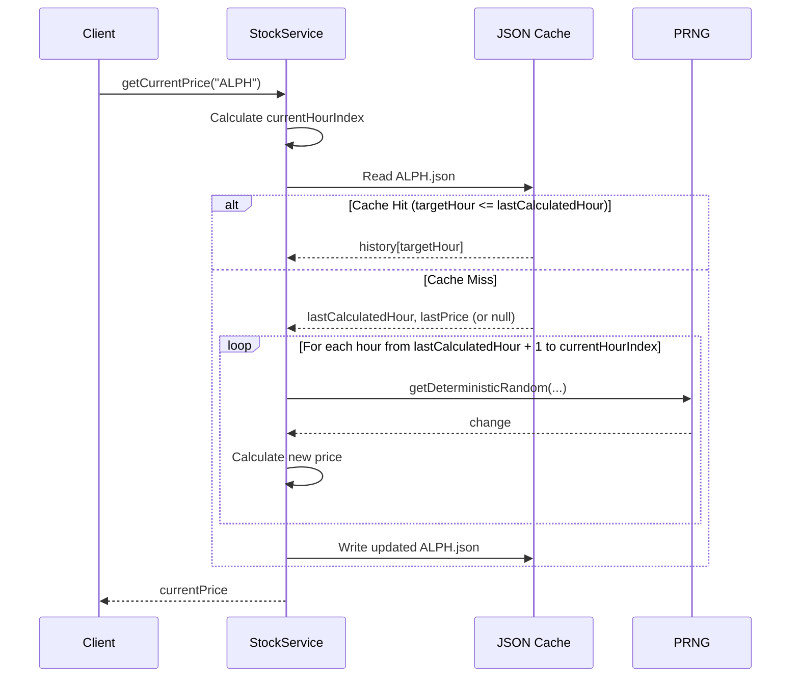

# Stock Pricing Design

This document outlines the design for a seed-based, deterministic stock pricing system for the FiveM Stock Market.

## 1. Deterministic Price Generation

The price of a stock at any given time is calculated based on a global seed, a stock-specific identifier (ticker), and the number of hours elapsed since a fixed start date.

### Core Algorithm

The price at hour $H$ is defined as:
$$Price(H) = Price(H-1) \times (1 + Change(H))$$

Where:
- $Price(0)$ is the **Base Price**, deterministically generated from the stock ticker.
- $Change(H)$ is the percentage change for hour $H$, deterministically generated from the combination of the global seed, ticker, and hour index.

### PRNG Implementation

Since `Math.random()` is not seedable in Node.js, we use a cryptographic hash (SHA-256) to generate deterministic values:

```typescript
import { createHash } from 'crypto';

function getDeterministicRandom(seed: string): number {
  const hash = createHash('sha256').update(seed).digest('hex');
  // Use the first 8 characters (32 bits) to get a float between 0 and 1
  return parseInt(hash.substring(0, 8), 16) / 0xffffffff;
}
```

## 2. Realistic Volatility

To meet the requirement of hourly changes between ±0.1% and ±0.5%, the $Change(H)$ is calculated as follows:

1.  **Seed**: `hour_seed = global_seed + ":" + ticker + ":" + hour_index`
2.  **Magnitude**: `r1 = getDeterministicRandom(hour_seed + ":magnitude")`
    - `magnitude = 0.001 + (r1 * 0.004)` (Range: 0.001 to 0.005)
3.  **Direction**: `r2 = getDeterministicRandom(hour_seed + ":direction")`
    - `direction = r2 > 0.5 ? 1 : -1`
4.  **Final Change**: `Change(H) = magnitude * direction`

## 3. Caching Strategy

To avoid redundant calculations, calculated prices are cached in JSON files within a runtime directory.

### Storage Structure

Files are stored in `server/runtime/cache/stocks/`:
- `[ticker].json`: Contains an array or map of calculated prices.

Example `ALPH.json`:
```json
{
  "ticker": "ALPH",
  "lastCalculatedHour": 150,
  "history": {
    "0": 100.0,
    "1": 100.2,
    ...
    "150": 112.5
  }
}
```

### Retrieval Logic

When `getPrice(ticker, target_hour)` is called:
1.  Load `server/runtime/cache/stocks/[ticker].json`.
2.  If file doesn't exist or `target_hour > lastCalculatedHour`:
    - If file doesn't exist, start from $H = 0$ and $Price(0) = BasePrice(ticker)$.
    - Otherwise, start from `lastCalculatedHour` and its corresponding price.
    - Iterate from the last known hour up to `target_hour`:
        - Calculate $Price(H)$ using the deterministic algorithm.
        - Add to the `history` object.
    - Update `lastCalculatedHour` and save the file.
3.  Return the price for `target_hour`.

## 4. Environment Configuration

The following variables must be defined in the `.env` file:

```env
# Global seed for deterministic price generation
STOCK_SEED=your_random_secret_seed_here

# Start date for the stock market (ISO 8601 format)
STOCK_START_DATE=2026-04-25T00:00:00Z
```

## 5. Integration: StockService

The logic will be encapsulated in a `StockService` class.

### Interface

```typescript
class StockService {
  /**
   * Returns the current price of a stock.
   */
  async getCurrentPrice(ticker: string): Promise<number>;

  /**
   * Returns a range of historical prices for a stock.
   */
  async getPriceHistory(ticker: string, fromHour: number, toHour: number): Promise<PricePoint[]>;

  /**
   * Internal method to calculate and cache missing hours.
   */
  private async ensurePricesCalculated(ticker: string, targetHour: number): Promise<void>;
}

interface PricePoint {
  hourIndex: number;
  timestamp: string;
  price: number;
}
```

### Workflow Diagram


